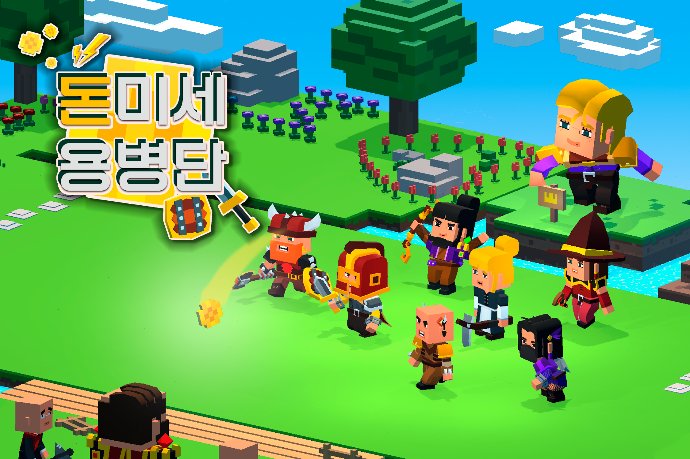

# 돈미세 용병단(DMS Mercenery)
### 현재 버전: v1.0.1 (Build 24.1111)

---

## 개요 Overview
 - 돈미세 용병단은 Direct3D 11를 사용하여 개발된 게임 엔진을 기반으로 한 게임입니다. 현재 리포지토리에서는 리소스와 실행 파일등을 제외하고, 소스 코드와 헤더만을 제공합니다.
The DMS Mercenery is a game built on a custom engine developed using Direct3D 11. Currently, the repository only provides source code and headers, excluding resources and executables.
---

## 설치 방법 Installation Instructions
1. 압축 파일을 다운로드하고 원하는 디렉터리에 압축을 해제합니다.
	Download and extract the compressed file to your desired directory.

2. dms.bat 를 실행하여 바로가기 파일을 생성합니다.
	Run dms.bat to create a shortcut file.

3. 바로가기 파일을 클릭하여 게임을 시작합니다.
	Click the shortcut to start the game.
---

## 제거 방법 Uninstallation Instructions
0. 작업 관리자의 백그라운드 프로세스에서 DSM_Merc.exe 작업 끝내기합니다.
	End the DSM_Merc.exe background process via Task Manager.

1. 설치된 디렉터리에서 게임 폴더를 삭제합니다.
	Delete the game folder from the installation directory.

2. Windows 설정 > 프로그램 추가/제거에서 해당 프로그램을 확인 후 제거합니다. (미구현)
	Check Windows Settings > Add or Remove Programs for the program and uninstall. (Currently not implemented)

---

## 시스템 요구사항 System Requirements

### 최소 요구사항 Minimum Requirements
- **OS**: Windows 10 (64-bit)
- **CPU**: Intel Core i3 or AMD equivalent
- **GPU**: DirectX 11 compatible GPU (4GB VRAM or higher)
- **RAM**: 4GB or more
- **Storage**: 2GB free space

### 권장 요구사항 Recommended Requirements
- **OS**: Windows 10/11 (64-bit)
- **CPU**: Intel Core i5 or AMD Ryzen 5 or higher
- **GPU**: DirectX 11 compatible GPU (6GB VRAM or higher)
- **RAM**: 8GB or more
- **Storage**: 2GB free space

### 소프트웨어 구성요소 Software Components
- DirectX 11
- Sound: FMOD
- Input: Keyboard, mouse support
- Physx
- Entt
- Spdlog
- Imgui
---

## 조작법 Controls
- **상호작용**: 마우스 좌클릭
	Interaction: Left Mouse Click
- **팝업창 ON/OFF**: ESC 키
	Popup Window ON/OFF: ESC Key

---

## 알려진 문제점 및 예상되는 해결 방법 Known Issues and Expected Fixes

1. **체력바 레이어 문제**
   - **원인**: 체력바와 팝업 레이어의 Z-인덱스 설정 문제.
   - **해결 방법**: 체력바의 Z-인덱스를 팝업 레이어보다 낮게 조정하여 팝업이 최상위에 오도록 수정.

2. **마우스 위치 인디케이터 출력 시점 문제**
   - **원인**: 마우스 인디케이터가 배치 전에 활성화됨.
   - **해결 방법**: 배치가 완료된 후 마우스 인디케이터가 활성화되도록 로직 수정.

3. **튜토리얼 전투 단계에서 마우스 위치 인디케이터 색상 문제**
   - **원인**: 전투 단계에서 인디케이터 색상 설정이 잘못되어 빨간색으로 표시됨.
   - **해결 방법**: 튜토리얼 단계마다 인디케이터 색상을 동적으로 설정하도록 변경.

4. **구름 UI의 경계선 표시 문제**
   - **원인**: 구름 UI 이미지의 가장자리 테두리가 보임.
   - **해결 방법**: 구름 UI의 알파 블렌딩 및 테두리 투명도 조정을 통해 경계선이 사라지도록 수정.

5. **로딩바 이동 시 밀림 현상**
   - **원인**: 로딩바 애니메이션 로직이 상승 및 하강 시 밀리는 문제가 있음.
   - **해결 방법**: 이징 함수 수치를 수정.

6. **결과창에서 대장 캐릭터 위치 어색함**
   - **원인**: 결과창 레이아웃에서 캐릭터 위치가 어색하게 배치됨.
   - **해결 방법**: 대장 캐릭터의 위치를 변경 혹은 발판 크기 조정.

7. **타이틀 화면 종료 시 옵션 팝업창 출력 문제**
   - **원인**: 설명창 종료 시 ESC 키가 옵션 팝업창까지 트리거됨.
   - **해결 방법**: 설명창 닫기와 옵션 팝업 출력의 ESC 키 처리를 분리하여 독립적으로 작동하도록 수정.

8. **장애물에 동전 설치 문제**
   - **원인**: 장애물에 동전이 배치됨.
   - **해결 방법**: 동전이 장애물의 위치에 배치 될 경우 삭제하도록 수정/ 피킹을 수정하여 장애물의 위치에 배치되지 않도록 수정.

9. **프로그램 종료 후 백그라운드 프로세스 잔류**
   - **원인**: 일부 리소스가 정상적으로 해제되지 않아 백그라운드 프로세스에 남아 있음.
   - **해결 방법**: 종료 시 리소스 해제 및 모든 프로세스를 강제 종료하도록 수정.

10. **동전과 유닛 상호작용 중 씬 전환 시 크래시**
    - **원인**: 물리 객체들의 물리 시뮬레이션 필터들의 세팅을 다음 프레임에 처리하는데, 객체가 삭제 된 경우 처리를 하지 못하는 문제가 있음.
    - **해결 방법**: 객체가 유효하지 않은 경우 세팅하지 않도록 수정.

11. **결과창에서 다음 버튼 반복 클릭 문제**
    - **원인**: 다음 버튼을 여러 번 누르면 구름이 덮여지는 효과가 여러번 발생함.
    - **해결 방법**: 다음 버튼 클릭 시 일시적으로 비활성화하여 다중 클릭 방지.

12. **적군 사망 후 클리어 시 애니메이션 멈춤 문제**
    - **원인**: 적군/아군이 모두 사망하고 결과창으로 넘어갔을때, 애니메이션을 멈추도록 설정했기 때문.
    - **해결 방법**: 적군 사망 애니메이션이 끝까지 재생되도록 수정.

13. **KeyUp 이벤트가 여러 프레임 반복 반환되는 문제**
    - **원인**: 키 이벤트 처리에서 KeyUp 신호가 과도하게 중복 처리됨.
    - **해결 방법**: KeyUp 이벤트가 1회만 반환되도록 입력 매니저의 KeyUp 로직 최적화.

14. **Time Over 시 클리어로 처리되는 문제**
    - **원인**: 시간 초과 시 게임 상태가 제대로 업데이트되지 않아 클리어로 잘못 처리됨.
    - **해결 방법**: Time Over 시 클리어가 아닌 실패로 처리되도록 게임 상태 로직을 수정하여 시간 조건에 따라 올바르게 상태가 전환되도록 개선.

15. **결과창의 다음 스테이지 버튼 비작동 문제**
    - **원인**: 불명
    - **해결 방법**: 불명
    - **기타**: 장시간 플레이를 하던 중 단 한번 발생한 상황으로, 프로세스 자체는 정상적으로 진행됨.

16. **적군 유닛의 애니메이션이 Loot에서 Move로 바뀌지 않는 문제**
    - **원인**: 애니메이션 처리 실수
    - **해결 방법**: 아군 유닛의 경우 정상적으로 작동하기 때문에 아군 유닛과 동일하게 로직을 수정.
---

## 버전 기록 History

### v1.0.0
- 첫 공식 릴리즈 (Build 241111)
	Official Initial Release (Build 241111)
### v1.0.1
- 마우스 드래그를 막아서 장애물에 동전 배치되는 버그 발생 빈도를 줄임
	Reduced bug occurrence rate for coin placement on obstacles by disabling mouse dragging.
